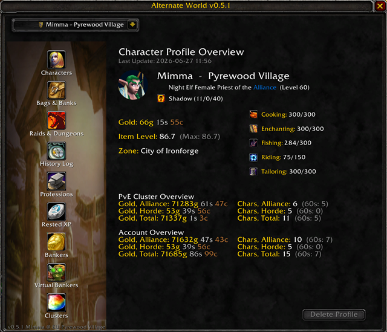
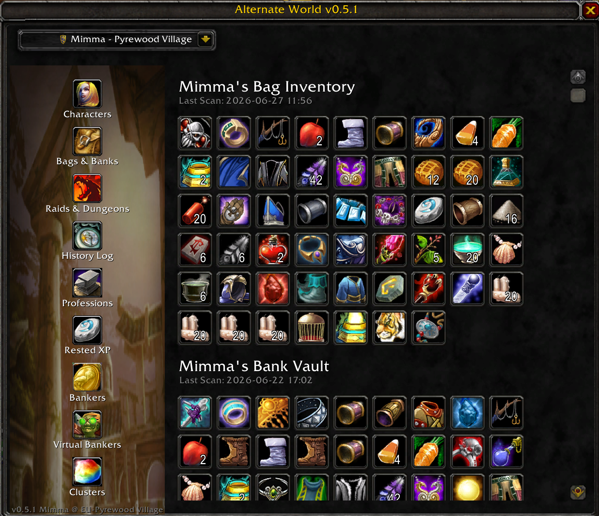
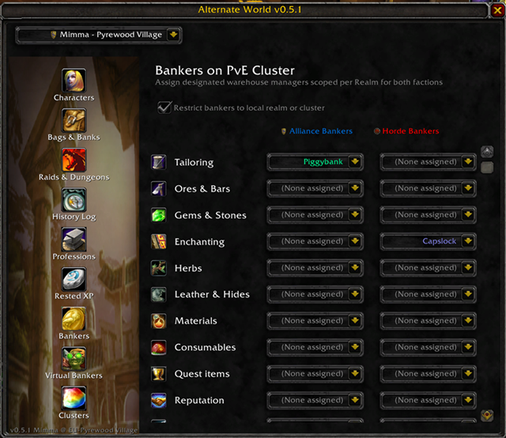
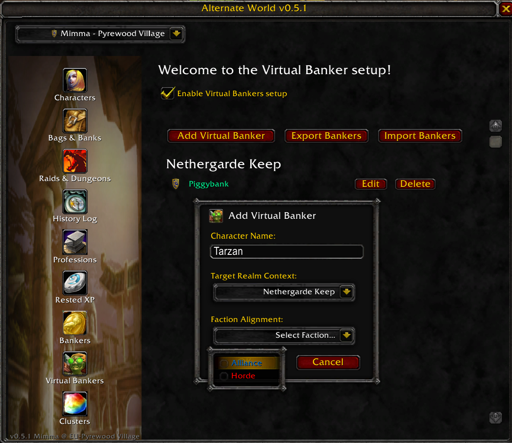
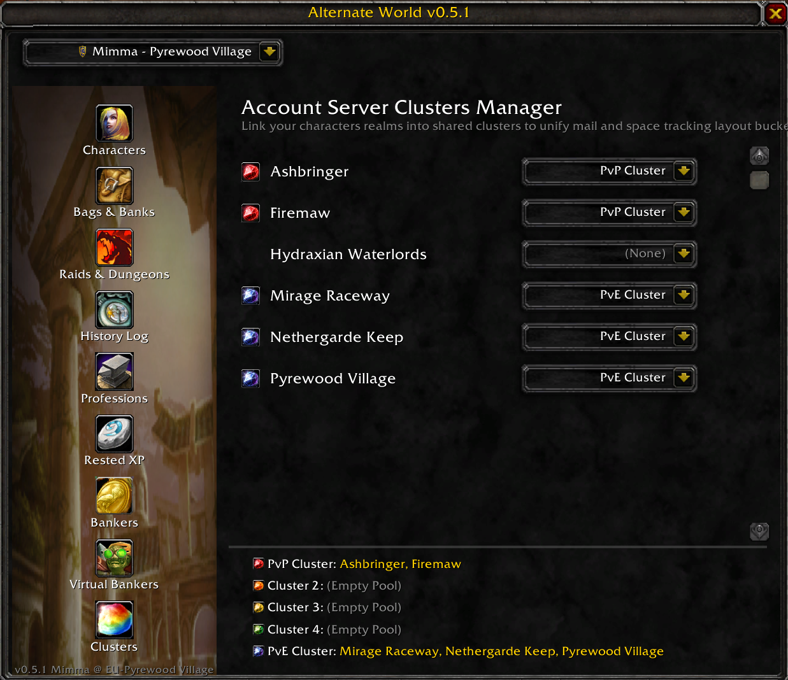

# Alternate World - User Guide

Alternate World is an inventory tracking and mail automation addon for World of Warcraft Classic Era. It is explicitly designed for players managing large rosters of alternative characters (alts), including setups where characters are spread across multiple separate accounts.

Simply type `/aw` to open the addon.

### Features at a Glance
* **Character Data**: Real-time tracking of Rested XP, professions, money, bags, and bank contents.
* **Lockouts & Progression**: Instant visibility of active raid IDs, lockouts, and attunement statuses.
* **Mail Automation**: Assign and route item categories (e.g., Cloth, Ore, Herbs) to specific mail recipients.
* **Cross-Account Fleet**: Seamless profile exporting, importing, and tracking for external account alts.

## Module Workflows

### 1. Main Panel & Navigation
Open the addon interface by typing `/aw` in the chat bar. The interface uses a sidebar navigation system to switch between views. All sub-dialogs and popups automatically close whenever the main window is hidden or closed.

### 2. Character Tracking
The addon tracks location, gold, bag inventory, bank contents, talent specs, attunements, and rested XP for your characters. Data is compiled automatically when you open your bags, bank, or character panels in game.

### 3. Automated Mail Matrix (Bankers Configuration)
Assign specific characters to process designated material types (e.g., Cloth, Ore, Herbs) from your alts.
* **Hierarchical Sorting**: The category selection dropdowns are sorted by **Realm > Character Name**.
* **Visual Cleanup**: Server name suffixes (like `-mir` or `-net`) are removed from row text. Realms are displayed as clean white section headers, and characters are indented by three spaces below their respective realm, colored by their specific class.

Note the Cloth banker on the Alliance-side: they are colored light-green. This indicates a **Virtual Banker**: A reference to a character on another account. See more below under Cross-Account References.
On the Horde-side, a banker is assigned to Enchanting—this character is on the same account, so the color displays their actual class: Warlock.

### 4. Cross-Account References (Virtual Bankers)
If you send mail to characters belonging to a different account, you can register them as a **Virtual Banker**.
* **Isolated Reference**: Registered manually or via string import. They use an exclusive jade-green color profile in the UI.
* **Data Shuttling**: Includes text-based serialization tools to export or import profile strings directly between game clients, bypassing account layout limitations.
* **Input Enforcement**: Automated input validation blocks special characters, quotation formats, and whitespaces during creation or modification to prevent SavedVariables file corruption.

You can create, edit, and delete virtual bankers—references to characters outside your account. They do not even need to be on the same realm as you, although you can obviously only mail them if you are on the same realm or cluster.

### 5. Multi-Realm Clusters
Configure specific cross-realm boundaries within the configuration engine to manage logistics networks on connected or clustered realm groups.

You can assign realms to one of five predefined clusters. They are by default named cluster 1 to 5, but you can rename a cluster by clicking its name.
Setting up clusters will allow you to assign banker characters not only from your home realm, but also from the realms in that cluster—if any.

If you do not want to define clusters but see all bankers regardless of realm, simply untick the "Restrict bankers to local realm or cluster" checkbox on the Bankers page.

